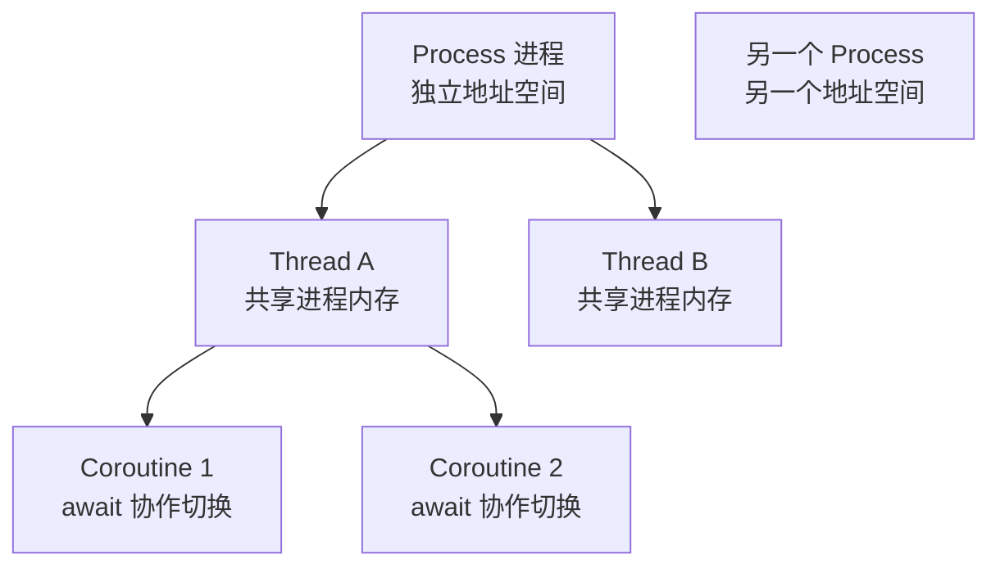
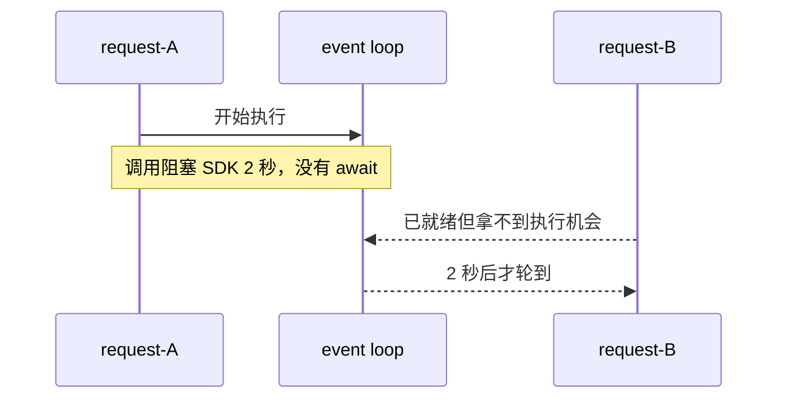

# 00 · 进程、线程、协程：先搞清“谁拥有状态，谁负责切换”

这一章不从术语定义开始，而从一个后端最常见的问题开始：

> 同一时刻有 100 个请求在等待数据库、2 个图片压缩任务在吃 CPU、1 个后台任务在发邮件。它们到底应该放在线程、协程还是进程里？

## 1. 先看全局图



核心不是“哪个更快”，而是三件事：

1. **隔离**：状态是不是天然共享；
2. **调度**：谁决定切换；
3. **并行**：能否真的同时占用多个 CPU 核。

## 2. 用一个具体状态理解

假设父进程里有：

```python
shared = []
```

两个线程都拿到同一个 Python 进程中的对象引用，所以：

```text
thread-A append("A")
thread-B append("B")

parent 最后能看到 ["A", "B"]
```

但两个子进程有自己的地址空间。父进程想拿回结果，必须通过 stdout、pipe、socket、shared memory 等 IPC。

协程更容易混淆：两个 coroutine 通常既在**同一个进程**，又在**同一个线程**。它们靠 `await` 主动把控制权交回 event loop。

## 3. 运行现有实验

```bash
python 00-Computer/01-process_thread_coroutine.py
python 00-Computer/02-cpu_bound_vs_io_bound.py
```

第一份实验会打印 PID、线程名和 coroutine 运行位置。重点不是背输出，而是观察：

```text
线程：PID 相同，thread name 不同
进程：PID 不同
协程：PID 相同，thread name 通常也相同
```

## 4. 核心代码带读

真实实验中的关键路径是：

```python
async def coroutine_job(label: str) -> Identity:
    await asyncio.sleep(0)
    return current_identity(label)

async def run_coroutines() -> list[Identity]:
    return await asyncio.gather(
        coroutine_job("task-A"),
        coroutine_job("task-B"),
    )
```

执行前：

```text
event loop runnable queue = [task-A, task-B]
当前线程 = MainThread
```

`task-A` 跑到 `await asyncio.sleep(0)` 后，它不是“开了一个新线程”，而是把自己挂起，让 event loop 去执行 `task-B`。

执行后：

```text
两个 task 都完成
PID 仍然相同
线程仍然相同
```

因此：**协程解决的是等待期间别闲着，不等于 CPU 并行。**

## 5. 为什么 async 里仍然可能卡死所有请求



如果 `async def` 里直接调用阻塞数据库驱动或 CPU-heavy 代码，event loop 没有切换点，同一线程里的其他 coroutine 一样被拖住。

## 6. 什么时候选哪一种

- **大量网络/数据库等待**：优先 async I/O 或线程池；
- **CPU heavy**：考虑多进程、原生并行库或独立 worker；
- **共享大量 Python 状态**：线程沟通便宜，但竞争和锁更复杂；
- **需要故障隔离**：进程边界更强，但 IPC 更贵。

不要把这变成固定规则。先看工作负载和状态边界。

## 7. Saleor 映射

Saleor `3.23.25` 的开发启动命令使用 Uvicorn，后台任务使用 Celery。它们恰好体现了两类不同工作：

```text
HTTP/GraphQL 请求
→ ASGI/Uvicorn 进程中的请求执行

后台耗时工作
→ Celery worker
→ 与 Web 请求生命周期分离
```

课程后面会具体进入 `saleor/celeryconf.py`。这里先记住：**Web 并发模型和后台任务执行模型不是一回事。**

## 8. 练习

1. 手算：一个进程内两个线程分别修改同一个 list，为什么父线程通常能看到修改？两个子进程为什么不能靠普通 list 共享？
2. 运行 `01-process_thread_coroutine.py`，记录三类任务的 PID / thread name。
3. 把 coroutine 中的 `await asyncio.sleep(0)` 换成 `time.sleep(0.5)`，预测两个 task 的总时间，再运行验证。
4. 设计题：图片压缩和 1000 个 HTTP 等待任务同时出现，你会把哪一类放进独立 worker？为什么？
5. 故障题：一个 `threading.Lock` 能否防止两个不同 Pod 同时扣库存？解释它保护的地址空间边界。

### 费曼复述

> 为什么“async 能处理很多并发请求”不等于“async 能让 CPU 任务自动并行”？
