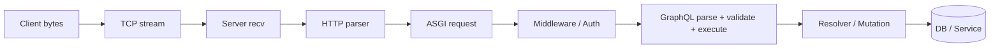
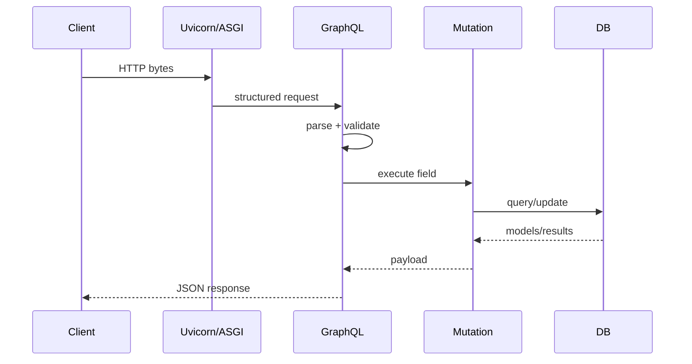

# 01 · 一条 HTTP 请求如何从字节变成业务函数

这一章只追一条请求：

```http
POST /echo HTTP/1.1
Content-Length: 5

hello
```

目标是把“浏览器请求接口”拆成可观察的层，而不是先学 Django API。

## 1. 运行链



最容易犯的错误是把 TCP 当成“HTTP 消息快递员”。TCP 只提供**有序字节流**，不保证一次 `recv()` 就对应一条完整 HTTP request。

## 2. 为什么一次 recv 不够

现有 Tiny HTTP Server 故意把请求分三次发送：

```python
client_side.sendall(b"POST /echo HTTP/1.1\r\nContent-Length: 5\r\n")
client_side.sendall(b"Content-Type: text/plain\r\n\r\nhe")
client_side.sendall(b"llo")
```

服务端只能不断累计：

```python
chunk = connection.recv(4096)
data.extend(chunk)

if header_end is None and b"\r\n\r\n" in data:
    ...

if header_end is not None and len(data) >= header_end + content_length:
    break
```

状态变化是：

```text
第一次 recv: 只有部分 header
第二次 recv: header 完整 + body="he"
第三次 recv: body="hello" → 条件满足 → 可以解析
```

这就是“协议边界由应用层解析”的具体含义。

## 3. WSGI / ASGI 到底解决什么

如果每个 Python Web 框架都自己处理 socket、TLS、keep-alive、HTTP/2、超时和连接管理，重复工作巨大。

于是把职责拆开：

```text
Uvicorn / Server
负责连接、协议、事件循环
        ↓ 标准调用契约
ASGI App
负责把结构化 request 交给 Django/Saleor
```

ASGI 不是 TCP，也不是业务路由。它是一层**Server 调用 Python Application 的契约**。

## 4. 从 REST 到 GraphQL：差别发生在哪一层

REST 常把动作分散在 URL + method：

```text
GET /products/1
POST /checkout
```

GraphQL 通常把 HTTP endpoint 固定，再把“我要什么”放进 query document：

```graphql
mutation {
  checkoutComplete(id: "...") { ... }
}
```

因此 GraphQL 入口里多了一层：

```text
parse → validate → execute → field resolver
```

不是“GraphQL 没有 HTTP”，而是 HTTP 之上还有 GraphQL 自己的语义层。

## 5. Saleor 3.23.25 的真实入口

`saleor/graphql/api.py` 在固定 tag 中组合了 `Query` 与 `Mutation`，其中 Checkout、Order、Payment、Webhook 等域都被挂进统一 GraphQL schema。

核心结构可以压缩成：

```python
class Query(
    CheckoutQueries,
    OrderQueries,
    PaymentQueries,
    ProductQueries,
    ...,
):
    pass

class Mutation(
    CheckoutMutations,
    OrderMutations,
    PaymentMutations,
    ...,
):
    pass
```

这段代码的意义不是多继承语法本身，而是：**一个 GraphQL endpoint 后面组合了多个业务域，真正行为继续下沉到具体 resolver/mutation。**

## 6. 一次请求的状态变化



后面每一章都会继续沿这条 spine 深挖，不重新发明入口。

## 7. 生产边界

教学 server 没有实现：TLS、keep-alive、chunked encoding、HTTP/2、连接超时、请求体大小限制、backpressure、graceful shutdown。这些不是“高级装饰”，而是生产流量下的失败边界。

## 8. 练习

1. 为什么 TCP `recv(4096)` 返回 100 字节，并不代表客户端只发了 100 字节？
2. 手算上面的三段 send：每次接收后 `header_end` 与 body 长度分别是什么？
3. 修改 Tiny HTTP Server，把 `Content-Length` 改错，观察服务端为什么会等待或截断。
4. 画出 `HTTP → ASGI → GraphQL → resolver` 四层职责边界，并给每层写一个“它不负责什么”。
5. 设计题：如果 GraphQL query 解析成功但业务 mutation 抛异常，哪一层应该把它转换成用户可见错误？哪些日志应该保留 request id？

### 费曼复述

> 为什么 Uvicorn、ASGI、Django、GraphQL 不是四种互相竞争的 Web 框架，而是可以位于同一条请求链的不同层？
