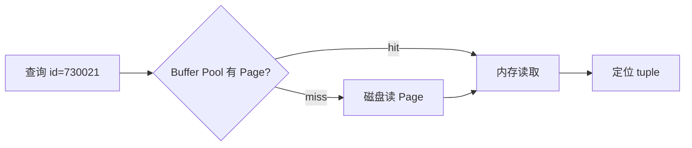

# 02 · 数据库：从一次磁盘 I/O 推到 B+Tree、Planner 与事务

数据库章节不从 `CREATE INDEX` 开始。先问：

> 一张商品表从 100 行长到 1 亿行后，`WHERE product_id = ?` 为什么不能永远从头扫到尾？

## 1. 先建立 Page 思维

磁盘/SSD 与数据库不是按“某一行”来回搬数据，而是以 page/block 为基本 I/O 单位。



如果一页 8 KiB，里面放几十或上百行，那么“查一行”的真实成本经常是“先定位并读取若干页”。

这就是为什么数据库索引首先是在降低**需要访问的 page 数**。

## 2. 为什么普通二叉树不适合磁盘索引

假设每个树节点都落在一个 page：

```text
BST 高度 30 → 最坏大约 30 次 page hop
高 fan-out B+Tree 高度 3~4 → 大约 3~4 次 page hop
```

数据库喜欢高 fan-out，因为一个内部 page 可以装很多 separator 和 child pointer，让树很矮。

## 3. B+Tree 的关键不是“长得像树”

现有实验 `04-bplus_tree.py` 真正值得理解的是三个不变量：

1. 内部节点只负责导航；
2. 完整记录/value 留在叶子；
3. 所有叶子在同一深度，并通过 `next_leaf` 串起来。

```mermaid
flowchart TB
    R[Internal: 10 | 20] --> L1[Leaf: 1 5 8]
    R --> L2[Leaf: 10 12 17]
    R --> L3[Leaf: 20 25 30]
    L1 -. next_leaf .-> L2
    L2 -. next_leaf .-> L3
```

## 4. 核心代码：范围查询为什么只从根定位一次

```python
leaf = self._find_leaf(start)
result = []
while leaf is not None:
    for key, value in zip(leaf.keys, leaf.values, strict=True):
        if key > end:
            return result
        if key >= start:
            result.append((key, value))
    leaf = leaf.next_leaf
```

执行 `range_search(7, 12)`：

```text
root → 找到包含 7 的 leaf
然后不再回 root
沿 leaf linked list: 7,8,9 ... 12
```

这解释了为什么 B+Tree 对范围扫描很自然。

## 5. split 时状态怎么变

叶子溢出前：

```text
Leaf [5, 6, 7, 10]   max_keys=3
```

分裂后：

```text
Left  [5,6]
Right [7,10]
父节点新增 separator=7
Left.next_leaf = Right
```

关键代码：

```python
right = Node(
    leaf=True,
    keys=leaf.keys[split_at:],
    values=leaf.values[split_at:],
    next_leaf=leaf.next_leaf,
)
leaf.keys = leaf.keys[:split_at]
leaf.next_leaf = right
self._insert_in_parent(leaf, right.keys[0], right)
```

父节点拿到的是**导航副本**，叶子里的完整 key 不消失。

## 6. 有索引为什么 Planner 仍可能不用

索引不是“创建后强制走”。Planner 比较成本：

```text
顺序扫全表
vs
走索引定位很多 tuple + 回表
```

当条件选择性很低，例如 `is_active = true` 命中 90% 数据，走索引可能需要大量随机访问，顺序扫描反而更便宜。

所以课程里的 PostgreSQL 实验要看：

```sql
EXPLAIN (ANALYZE, BUFFERS)
```

而不是只看 SQL 能不能返回结果。

## 7. 从索引进入事务：并发修改发生什么

读快了以后，下一个真实问题是两个请求同时写：

```text
库存 = 1
A 读到 1
B 读到 1
A 写 0
B 写 0
两单都成功 → 超卖
```

这逼出 transaction isolation、row lock 和 `SELECT ... FOR UPDATE`。真正业务例子放在第 06 章展开。

## 8. Saleor 的真实行锁

Saleor `3.23.25` 的 `saleor/checkout/lock_objects.py` 里直接存在：

```python
def checkout_qs_select_for_update() -> QuerySet[Checkout]:
    return Checkout.objects.order_by("pk").select_for_update(of=(["self"]))


def checkout_lines_qs_select_for_update() -> QuerySet[CheckoutLine]:
    return CheckoutLine.objects.order_by("pk").select_for_update(of=(["self"]))
```

先不要把它理解成“Django API”。它表达的是数据库不变量：

```text
同一个 transaction 持有目标行锁
→ 竞争 transaction 不能随意同时修改同一行
→ commit/rollback 后锁释放
```

为什么 `order_by("pk")` 也值得关注？因为多个对象按稳定顺序获取锁，是降低复杂死锁组合的一种工程手段；是否足够还要结合完整调用链判断。

## 9. 教学 B+Tree 与真实 PostgreSQL 的差距

我们的 Python B+Tree 没有：WAL、MVCC、固定 page layout、crash recovery、并发 latch、vacuum、删除合并。它只负责让你看见树结构不变量。

不要把“我手写了 B+Tree”误解成“我实现了数据库索引”。真正数据库的难点很大一部分在**持久化与并发恢复**。

## 10. 练习

1. 一个 3 层 B+Tree，如果每个内部节点平均 fan-out=200，理论上叶子层大约能挂多少个 child 范围？
2. 为什么范围查询适合叶子链表，而 hash index 更适合等值查找？
3. 手推插入 `[10,20,5,6,12,30,7,17]` 时第一次 leaf split 的前后状态。
4. 创建一个低选择性字段索引，用 `EXPLAIN` 比较命中 1% 和 90% 数据时 Planner 的选择。
5. 故障题：有索引以后写入为什么可能变慢？列出至少两类额外成本。
6. 并发题：解释“事务”与“行锁”为什么不是同一个概念。

### 费曼复述

> 如果 B+Tree 的目标只是“查得快”，为什么数据库还需要 Buffer Pool、WAL、MVCC 和 Planner？
