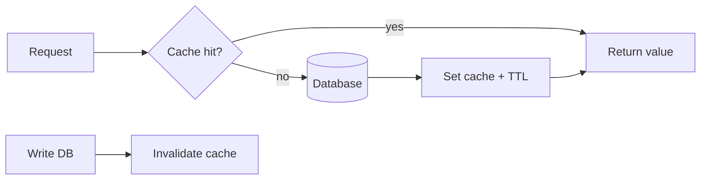
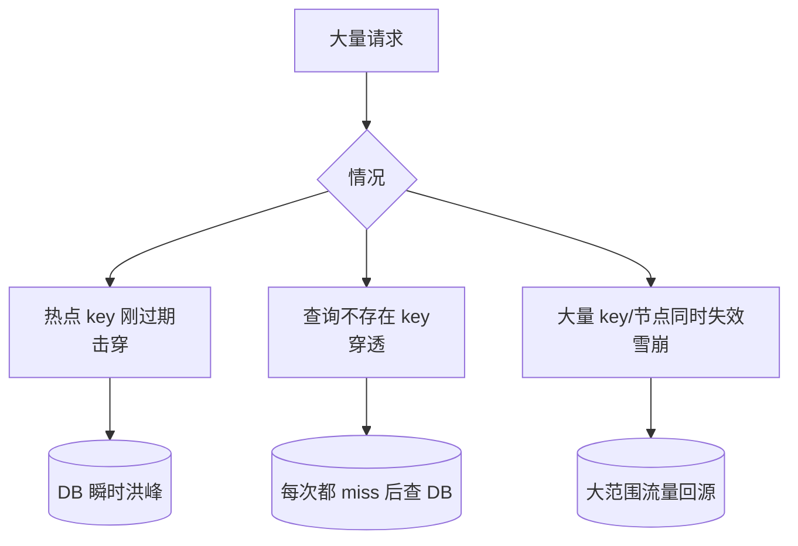

# 03 · Redis 与缓存：先让数据库真的被热点读打疼

上一章已经把单次查询做快了，但新的问题出现：

> 商品详情每秒被读取 10 万次，而价格一天只改几次。即使索引很快，让 10 万次请求全进数据库仍然浪费连接、CPU 和 Buffer Pool。

## 1. V0：每次都查数据库

```text
request → DB → response
```

它在低流量时完全合理：一致性简单、没有额外基础设施、调试最直接。

只有当你真的观察到热点读、连接池压力或延迟上升，缓存才开始有价值。

## 2. Cache Aside 的核心链



读路径：

```text
先 cache
miss → DB
DB value → cache
```

写路径常见选择之一：

```text
先更新 DB
再删除 cache
```

重点不是背顺序，而是承认：**DB 与 cache 是两个状态副本，它们不可能免费获得强一致。**

## 3. 运行 stale data 实验

```bash
python 03-Redis/01-cache_aside.py
```

核心代码：

```python
cached = cache.get(key, now)
if cached is not None:
    return cached, "cache-hit"

value = db[product_id]
cache.set(key, value, ttl=5, now=now)
return value, "db-read"
```

具体状态：

```text
t=0 DB=keyboard-v1, cache empty
→ DB read
→ cache=keyboard-v1

t=1 → cache hit

t=2 DB 改成 keyboard-v2，但 cache 没删
→ 仍返回 keyboard-v1  ← stale
```

缓存不是“让数据更快”的纯函数；它制造了一个新的**副本一致性问题**。

## 4. TTL 为什么既是保护也是风险

TTL 能限制 stale 最长时间，但 TTL 不是一致性协议。

```text
TTL 太长 → stale window 变大
TTL 太短 → miss 变多，DB 压力回来
大量 key 同时过期 → cache stampede
```

因此生产 TTL 通常会配合随机抖动、主动失效、single-flight/互斥重建等机制。

## 5. 击穿、穿透、雪崩分别是什么



不要把三个词当口诀：判断依据是**miss 为什么集中发生**。

## 6. 为什么 Redis 比进程内 dict 更常用于多实例

本地 dict：

```text
Pod A cache != Pod B cache
重启就丢
容量受单进程限制
```

集中式 Redis：

```text
多个 Web 实例共享同一个缓存视图
支持 TTL、原子操作和成熟数据结构
```

但它引入网络 hop 和新的可用性依赖。Redis 挂了时，系统是否允许降级回 DB？这必须在设计时决定。

## 7. 分布式锁不是缓存章节的万能答案

Redis 的原子命令可以用于某些协调，但不要看到并发就先上 distributed lock。很多业务更适合：

- 数据库唯一约束；
- 行锁；
- CAS/version；
- 幂等键；
- single-flight 只保护缓存重建。

机制应靠不变量选择，而不是靠“这个组件我会用”。

## 8. Saleor 映射

Saleor `3.23.25` 的依赖里包含 Redis client，同时 Django 配置通过 `django-cache-url` 接入 cache backend；Celery 依赖也支持 Redis/SQS。这说明 Redis 在真实系统里可能承担**缓存/基础设施后端**，但课程不会把“用了 Redis”直接等同于“所有状态都应该放 Redis”。

读源码时要问：

```text
这个 key 是可丢失派生数据？
还是权威业务状态？
失效后能否从 DB 重建？
```

只有前者天然更像缓存。

## 9. 什么时候不要缓存

- 请求量低；
- 数据高度个性化且几乎不复用；
- 一致性要求极高而 stale 不可接受；
- DB 已经足够快，缓存增加的复杂度高于收益。

“没有缓存”常常是小系统更正确的选择。

## 10. 练习

1. 手推 `01-cache_aside.py`：如果不执行 `cache.delete()`，最晚到什么时候能看到 v2？
2. 把 TTL 从 5 改成 1，说明 DB read 次数为什么会上升。
3. 设计一个“随机 TTL 抖动”函数，解释它缓解的是击穿还是雪崩。
4. 如果不存在的 `product:999` 每秒被查询 1 万次，如何减少 DB 压力？同时说明负缓存的风险。
5. 设计题：商品详情允许 5 秒 stale，但库存不能超卖。两类数据是否应该用相同缓存策略？为什么？
6. 故障题：Redis 整体不可用时，直接让所有流量回源 DB 会发生什么？你会加什么保护？

### 费曼复述

> 为什么“缓存命中率 99%”仍然不能证明你的缓存设计是正确的？
