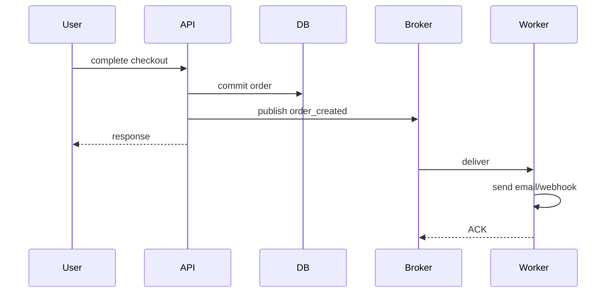
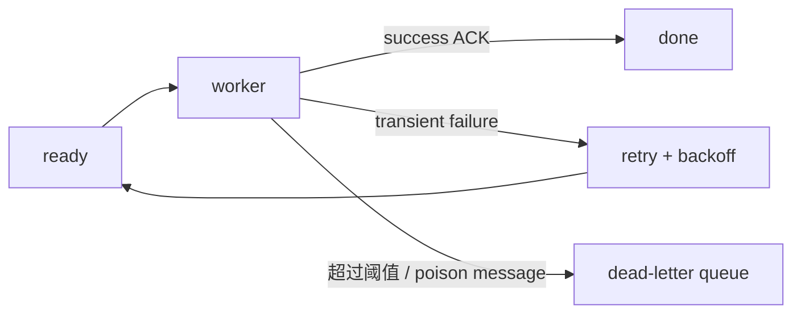
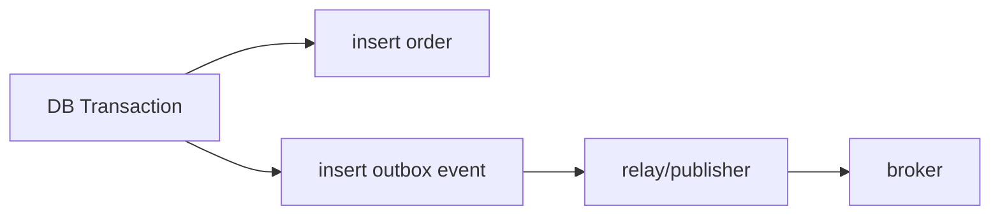

# 04 · Message Queue：把慢工作移出请求后，为什么反而出现“重复执行”

现在 TinyCommerce 下单完成后要：发邮件、通知 ERP、触发 Webhook。

V0 最简单：

```text
HTTP request
→ 创建订单
→ 发邮件 800ms
→ ERP 500ms
→ webhook 1000ms
→ response
```

功能正确，但用户延迟被所有外部系统相加，而且一个 webhook 超时可能拖垮整个请求。

## 1. 引入 Queue



Queue 把“用户必须等待的关键路径”和“可以稍后完成的工作”拆开。

代价是：**同步调用失败问题，变成消息交付语义问题。**

## 2. ACK 到底在确认什么

Broker 不知道业务副作用是否安全，只知道 consumer 有没有确认这条消息可以移除。

```text
收到消息
→ 做副作用
→ ACK
```

如果 consumer 在“副作用完成”后、“ACK 之前”崩溃：

```text
邮件已经发了
Broker 没收到 ACK
→ 消息重新投递
→ 邮件可能再发一次
```

这就是 at-least-once 系统最重要的事实之一。

## 3. 运行重复副作用实验

```bash
python 04-Message-Queue/01-at_least_once.py
```

核心代码：

```python
side_effects.append(f"email:{message.order_id}")
if fail_after_effect:
    broker.redeliver(message)
    return

processed.add(message.event_id)
```

实验故意在副作用后崩溃，最后你会看到两次 email side effect。

所以：**retry 不是可靠性的终点；retry 会把幂等变成必答题。**

## 4. 幂等 consumer

真正的检查应该发生在副作用之前，而且“检查 + 标记”本身要有并发安全边界：

```text
if event_id 已完成:
    return

执行副作用
原子记录 event_id 完成
ACK
```

但如果副作用是外部支付/邮件 API，仍然可能出现“外部成功、本地记录失败”的窗口。此时需要外部 idempotency key、可查询状态或更强的业务协议。

## 5. Retry 与 DLQ



DLQ 的目的不是“自动修好错误”，而是把**持续失败消息从主消费链隔离出来**，避免无限重试吃掉吞吐。

## 6. 为什么要指数退避

如果下游故障 30 秒，1000 个 worker 每毫秒重试一次：

```text
下游本来就在恢复
→ retry storm 再次压垮它
```

因此常见做法是：

```text
1s → 2s → 4s → 8s ... + jitter
```

本质是把失败反馈变成负反馈，而不是正反馈。

## 7. Transactional Outbox 为什么出现

另一个窗口：

```text
DB 订单 commit 成功
↓
进程在 publish message 前崩溃
↓
订单存在，但 order_created 永远没发出去
```

Outbox 把“业务状态”和“待发布事件”写进同一个数据库 transaction：



这样崩溃后 relay 还能从 outbox 重放未发布事件。

注意：Outbox 解决的是 **DB commit 与 publish 的原子缺口**，不自动让 consumer exactly-once。

## 8. RabbitMQ / Kafka / Celery 放在哪

- RabbitMQ：典型 broker/queue，路由与 ACK 模型直观；
- Kafka：更像持久化分区日志，offset、partition、consumer group 是核心；
- Celery：Python 任务框架，底层可使用 Redis/SQS 等 broker/backend。

不要把“Celery = RabbitMQ”。一个是任务执行框架，一个是可选消息基础设施。

## 9. Saleor 映射

Saleor `3.23.25` 有独立 `saleor/celeryconf.py`，开发命令中也明确区分：

```text
uvicorn saleor.asgi:application
celery --app saleor.celeryconf:app worker -E
```

这条边界说明 Web request 与 background task 的生命周期是分开的。后面 Saleor case study 会继续追 webhook / task 的实际触发位置。

## 10. 练习

1. 运行实验，指出第一次副作用发生、崩溃、重新投递、第二次副作用分别在哪一步。
2. 修改 demo：在执行副作用**之前**用 `event_id` 去重，观察还有没有重复。
3. 解释“at-least-once + idempotent consumer”和“exactly-once”为什么不是同一句话。
4. 设计 retry policy：最多 5 次，指数退避并加 jitter；写出每次大致等待时间。
5. 场景题：订单写库成功但消息没发出，为什么简单 `try: publish()` 不能彻底解决？
6. 设计题：哪些错误应该 retry，哪些应该直接进入 DLQ？给出两个例子。

### 费曼复述

> 为什么把慢任务丢进 MQ 后，系统虽然响应更快，却必须额外解决幂等、重试和事件一致性？
