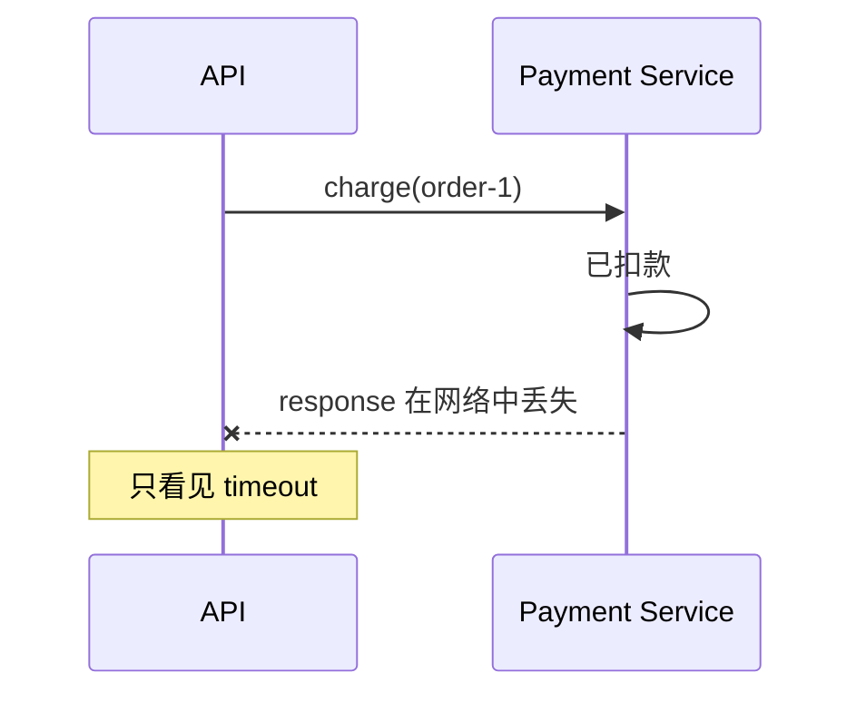
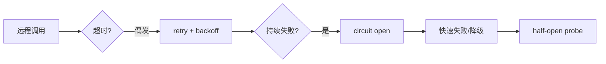

# 05 · 分布式系统：网络超时后，你其实不知道“对方做没做”

前一章引入 broker 后，系统已经跨进程/跨机器。现在最危险的问题不是“请求失败”，而是：

> **请求方看到 timeout，但服务端可能已经成功执行。**

## 1. timeout 不是业务失败



此时客户端拥有的是“不确定”，不是“失败”。

如果无脑 retry：

```text
第一次其实扣款成功
第二次再扣一次
```

## 2. 运行重试实验

```bash
python 05-Distributed-Systems/01-retry_idempotency.py
```

不带 key：

```text
order-1 被 charge 两次
```

带 idempotency key：

```python
if idempotency_key in self.results:
    return self.results[idempotency_key]

self.charges.append(order_id)
self.results[idempotency_key] = "ok"
```

第一次请求真正执行后，结果被 key 绑定；重试拿到旧结果，不再制造第二个副作用。

## 3. 幂等键保护的不是“HTTP 请求”，而是业务动作

错误设计：每次 retry 都生成新 key。

正确思路：

```text
同一个“支付订单 order-2 的这次支付意图”
→ 始终使用同一个 idempotency key
```

因此 key 的生命周期必须和业务 intent 对齐。

## 4. Retry 什么时候安全

先分类操作：

```text
GET/read             通常天然可重复
PUT set state        常容易设计成幂等
POST create/charge   可能产生重复副作用
```

但 HTTP method 只是提示。真正要看后端不变量。

## 5. Timeout、Retry、Circuit Breaker 的因果链



Circuit Breaker 不是让请求成功，而是**在下游持续失败时停止制造无意义压力**。

## 6. Backpressure：系统满了以后必须敢于拒绝

如果 worker 每秒只能处理 100 个任务，但入口每秒来 1000 个：

```text
queue length: 900, 1800, 2700 ...
延迟无限增长
内存/磁盘最终耗尽
```

所以生产系统需要 bounded queue、并发上限、429/503、load shedding 等手段。

“全部排队”不是可靠；它可能只是把故障推迟。

## 7. CAP 不要背成“三选二”口诀

更有用的问法：

> 当网络分区已经发生时，同一个逻辑数据的不同节点无法正常沟通，我是继续接受可能冲突的操作，还是拒绝一部分操作以保持一致？

CAP 讨论的是分区时的取舍，不意味着正常网络下一定永久只能选两个字母。

## 8. 无状态服务为什么容易横向扩展

如果 session/cart 临时状态只存在 Pod A 内存：

```text
请求 1 → Pod A 有状态
请求 2 → Pod B 看不到
```

把权威状态放入共享数据库/合适存储后，Web 实例更容易做到 disposable/stateless，再由负载均衡分发。

但“stateless”不等于“没有状态”，而是**实例本地不拥有必须长期保留的权威业务状态**。

## 9. Saleor 映射

Saleor 的 API-only 架构天然要面对外部 App/Webhook/Payment 的网络边界。读这些路径时，重点检查：

```text
是否有明确 timeout？
是否会 retry？
重复请求是否有业务身份？
结果未知时能否查询/对账？
```

不要只搜索一个叫 `retry()` 的函数；真正的可靠性常由多层协议共同形成。

## 10. 练习

1. 运行 demo，解释为什么 timeout 发生在“副作用之后”最危险。
2. 把 idempotency key 改成每次 retry 随机生成，预测结果。
3. 设计一个 `create_order` API 的 idempotency key：key 应和用户、cart、checkout 还是 HTTP request 绑定？说明理由。
4. 计算题：入口 500 req/s，worker 400 req/s，持续 60 秒后理论积压多少？
5. 故障题：下游持续 500 错误，为什么固定 10ms 重试可能让恢复更慢？
6. 解释“stateless Web Pod”与“Redis 里存 session”并不矛盾。

### 费曼复述

> 为什么 timeout 最重要的信息不是“失败了”，而是“我不知道远端最终状态”？
