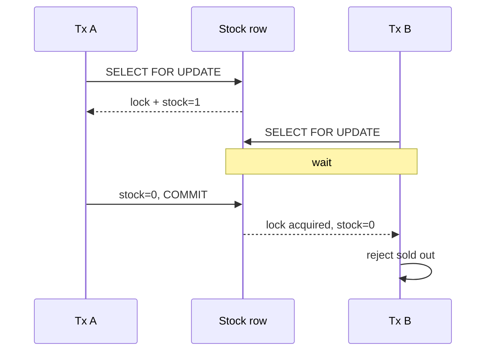
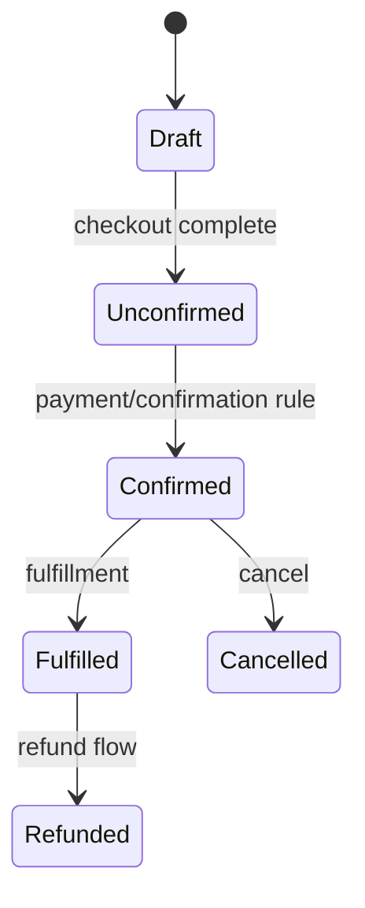
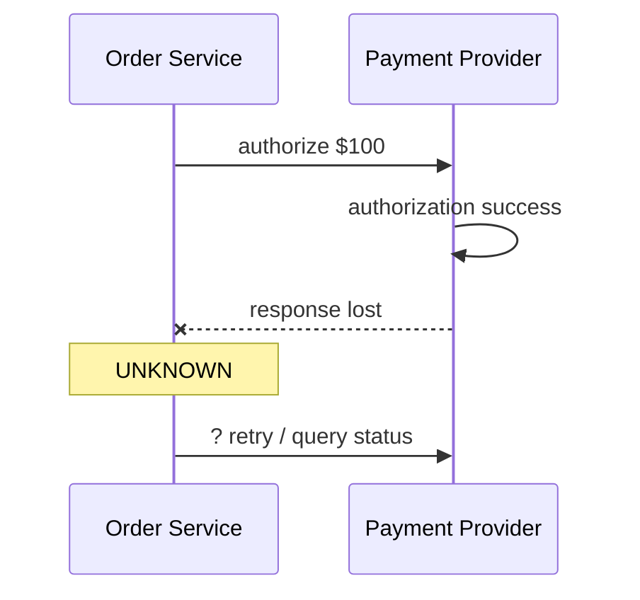
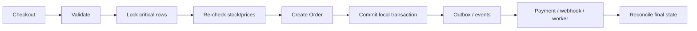

# 06 · 交易系统：库存、订单、支付为什么不能靠一个“大事务”包住世界

这一章把前面的数据库锁、重试、幂等和 MQ 放回真正的业务：

```text
Checkout → 库存 → Order → Payment → Fulfillment / Webhook
```

## 1. 先看最小超卖

库存只有 1：

```text
A read stock=1
B read stock=1
A 判断可以买
B 判断可以买
A write 0
B write 0
```

最终库存没有变成 -1，但**两张订单都成功了**。这就是典型 lost update / check-then-act race。

运行：

```bash
python 06-Transaction-Systems/01-overselling_and_lock.py
```

## 2. 为什么 transaction 本身不自动解决所有 race

两个 transaction 如果都允许先读旧值，再各自更新，仍可能出现冲突。

你需要的是一个明确不变量：

```text
对同一库存记录的“检查可用 + 扣减”必须串行化
```

常见实现：

```text
BEGIN
SELECT ... FOR UPDATE
检查 stock
UPDATE stock
COMMIT
```

行锁把同一个关键资源的竞争者排队。



## 3. Saleor 的 Checkout 行锁

Saleor `3.23.25` 的 `saleor/checkout/lock_objects.py`：

```python
def checkout_qs_select_for_update() -> QuerySet[Checkout]:
    return Checkout.objects.order_by("pk").select_for_update(of=(["self"]))


def checkout_lines_qs_select_for_update() -> QuerySet[CheckoutLine]:
    return CheckoutLine.objects.order_by("pk").select_for_update(of=(["self"]))
```

执行前：Checkout/lines 可以被多个请求竞争。

执行中：当前 transaction 对目标行持锁。

执行后：commit/rollback 释放锁，后续竞争者重新基于新状态判断。

这不是为了“数据库更高级”，而是为了保护业务状态机不被并发请求撕裂。

## 4. Order 为什么需要状态机

订单不能靠一个 `is_done`：



状态机的价值是把允许的 transition 显式化：

```text
当前状态 + 事件 → 新状态 + 副作用
```

这样才能回答重复事件、乱序事件和失败恢复。

## 5. 支付最难的是 unknown result



如果把 unknown 当 failed 直接重新扣款，可能重复支付。

因此真实支付系统通常需要：

- provider-side idempotency key；
- 本地 transaction/payment attempt identity；
- 查询状态/对账；
- webhook 作为异步最终证据；
- authorize / capture / refund 等明确状态。

## 6. 为什么不能把数据库 transaction 一直开到支付返回

想象：

```text
BEGIN DB transaction
锁库存
调用第三方支付，等待 8 秒
支付超时
...
```

长事务会长期占锁、连接和 MVCC 资源，而且数据库无法回滚第三方已经完成的扣款。

**数据库 transaction 只能原子控制它自己能控制的资源。**

跨系统一致性要靠状态机、幂等、事件、补偿和 reconciliation。

## 7. Saga：不是分布式 rollback

Saga 把长业务拆成已提交的小步骤：

```text
reserve stock
→ create order
→ authorize payment
→ schedule fulfillment
```

某一步失败后执行业务补偿：

```text
release stock
cancel order
void/refund payment
```

补偿不等于“时间倒流”。退款和“从没扣过款”在审计上是两个不同事实。

## 8. Outbox 放在交易链哪里

当本地 transaction 成功后需要发布 `order_created`：

```text
同一 DB transaction:
  write order
  write outbox(order_created)
COMMIT

relay later publishes event
```

这样避免“订单提交了，事件永久丢失”。Consumer 端仍然需要幂等。

## 9. Checkout → Order 的完整思维模型



关键点：**锁之后要重新检查**。因为等待锁期间世界可能已经变化。

## 10. 练习

1. 手推超卖 interleaving，指出哪两个动作之间形成 race window。
2. 为什么只给 `UPDATE stock = stock - 1` 加 transaction，仍必须考虑 `stock > 0` 约束怎么原子验证？
3. 设计一个 order state machine，禁止 `Cancelled → Fulfilled`。
4. 支付 provider timeout 后，列出“明确失败 / 明确成功 / 未知”三种处理策略。
5. 为什么退款是补偿，不是数据库 rollback？
6. 解释 Outbox 解决的原子缺口，以及它**没有**解决的 consumer duplicate 问题。
7. Saleor 阅读练习：从 `checkout_complete` mutation 入口找到调用 `complete_checkout` 的下一跳，并记录 transaction/lock 在哪里出现。

### 费曼复述

> 为什么一个电商“下单”看起来是一个按钮，后端却必须同时使用数据库事务、行锁、状态机、幂等、MQ 和补偿？
