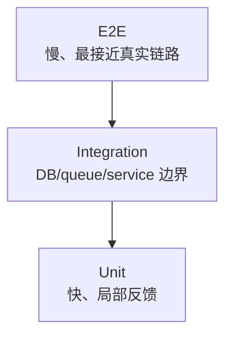
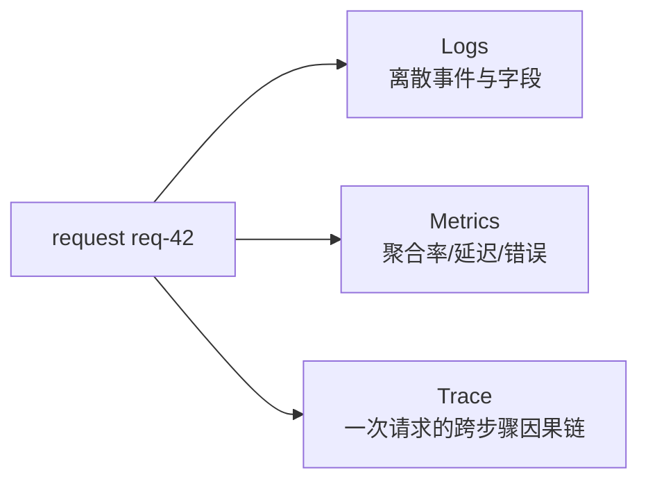

# 07 · 测试与可观测性：系统出错以后，怎么拿到“发生了什么”的证据

到现在 TinyCommerce 已经有：HTTP、DB、cache、queue、worker、payment。

新的问题是：

> 用户说“结算卡了 4 秒”，你本地跑测试全绿。到底慢在 API、数据库锁、支付还是 worker？

## 1. 测试和可观测性解决的不是同一个问题

```text
测试：在我们设计的输入下，系统是否满足预期？
可观测性：线上真实执行时，内部发生了什么？
```

测试不能覆盖所有生产 interleaving；日志也不能替代可重复验证。

## 2. 测试金字塔先从故障成本理解



不是“Unit 越多越好”，而是把不同问题放到最便宜且足够真实的层：

- 纯状态机 transition：unit；
- transaction / row lock：integration + real DB；
- checkout → order 关键路径：少量 E2E。

## 3. 并发 bug 为什么普通 unit test 看不见

超卖依赖特定 interleaving：

```text
A read
B read
A write
B write
```

单线程顺序测试可能永远不会产生这个窗口。

因此并发测试要主动制造 barrier/延迟，并检查**业务不变量**，例如：

```text
stock 永不 < 0
成功订单数 <= 可用库存
```

比“函数返回 True”更接近真正目标。

## 4. Log、Metric、Trace 各看什么



### Log

适合回答：某一步发生了什么？关键业务 ID 是什么？

```text
request_id=req-42 order_id=o-7 event=checkout_locked
```

### Metric

适合回答总体变化：

```text
checkout_latency_p95
payment_timeout_rate
queue_depth
cache_hit_ratio
```

### Trace

适合回答一次请求跨组件怎么走、慢在哪一跳。

## 5. 运行最小 trace

```bash
python 07-Testing-Observability/01-trace_pipeline.py
```

核心数据：

```python
Span("graphql.checkoutComplete", 12, {"request_id": request_id})
Span("db.lock_checkout", 8, {"request_id": request_id})
Span("db.create_order", 20, {"request_id": request_id})
Span("outbox.insert", 3, {"request_id": request_id})
```

输出会把同一个 `request_id` 下的步骤排出来，让“慢”从感受变成证据。

## 6. 为什么 p95/p99 比平均值更重要

假设 99 个请求 20ms，1 个请求 5s：

```text
平均值仍可能看起来不离谱
但那个 5s 用户真实存在
```

尾延迟常来自：锁竞争、GC、冷 cache、慢 SQL、下游 retry、queue backlog。

所以生产容量判断不能只盯平均值。

## 7. N+1 为什么在 GraphQL 特别值得警惕

假设查询 100 个 products，每个 product resolver 再单独查 variants：

```text
1 query products
+ 100 queries variants
= 101 queries
```

功能正确，但 query 数随结果规模增长。

验证方法不是“感觉慢”，而是记录 query count、SQL trace、测试阈值，再考虑 DataLoader/prefetch 等机制。

## 8. 观测本身也有成本

- 高基数 label 可能打爆 metric backend；
- 全量 trace 成本高，需要 sampling；
- 日志不能泄露 token/password/PII；
- 过多 debug log 可能改变时序甚至掩盖并发 bug。

因此 observability 也需要预算和 schema。

## 9. Saleor 映射

Saleor `3.23.25` 的依赖包含 OpenTelemetry API/SDK 与 Sentry integration，并且 GraphQL API 中存在字段使用 metrics。真实生产系统不仅写业务代码，还要让请求链可以被度量和诊断。

阅读时关注：

```text
request/context 中有哪些 correlation 信息？
GraphQL field/operation 如何记录指标？
Celery 与 Web 请求的 trace/context 如何衔接？
错误是否带业务实体 id？
```

## 10. 练习

1. 给 `01-trace_pipeline.py` 增加一个 300ms `payment.authorize` span，观察 slowest 变化。
2. 为什么 `queue_depth` 是 gauge，而“处理过的消息总数”更像 counter？
3. 设计一个超卖 integration test：你要如何让两个 transaction 真正并发？
4. N+1 题：50 个订单，每单单独查 3 类关联数据，最坏 SQL 数量如何增长？
5. 设计一个 dashboard，只允许 5 个核心指标。你会选哪些？为什么？
6. 隐私题：日志里哪些字段应该 hash/redact？列两个例子。

### 费曼复述

> 为什么“测试全绿”不能证明线上没问题，而“日志很多”也不能证明系统可观测？
