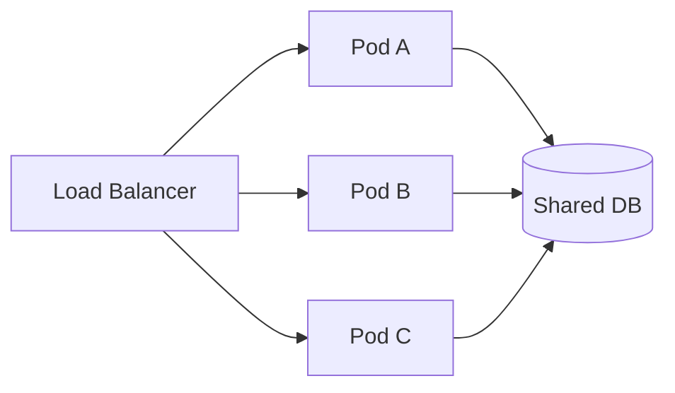
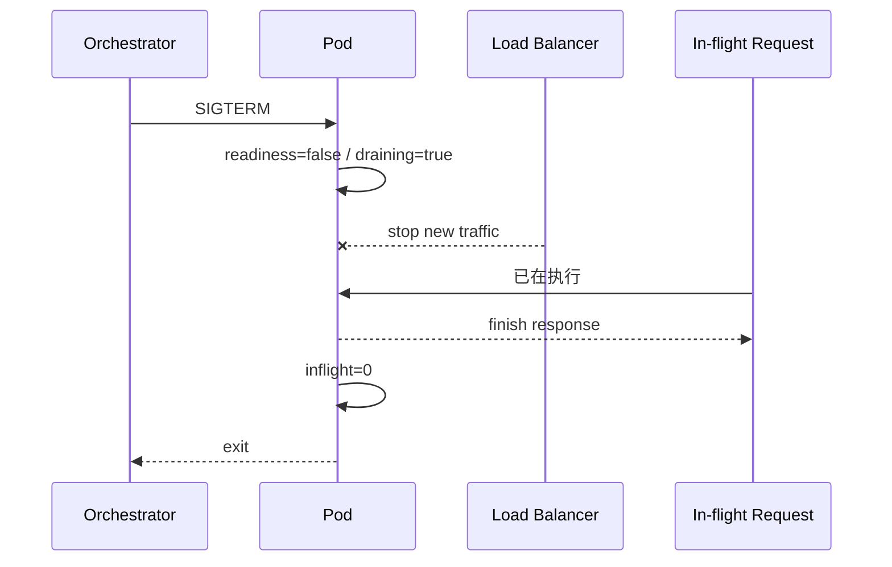

# 08 · 部署：多实例不是复制几份进程，发布也不是直接 kill

TinyCommerce 在一台机器上已经能工作。流量上来后，我们开 5 个实例。

新问题：

> 发布新版本时负载均衡还在把请求发给即将退出的 Pod；旧请求做到一半，进程被杀。用户看到 502，但数据库可能已经提交。

## 1. Stateless 为什么是横向扩展的前提之一



“stateless”不是没有状态，而是：

```text
Pod 本地内存不是必须长期保留的权威业务状态
```

这样任意健康实例都更容易处理下一次请求。

## 2. Liveness 与 Readiness 不一样

- **liveness**：这个进程是不是已经坏到需要重启；
- **readiness**：这个实例现在是否应该接新流量。

数据库迁移中、缓存预热中、正在 draining 的 Pod 可能仍然“活着”，但不应该继续接流量。

## 3. 优雅退出的顺序



错误顺序是收到 SIGTERM 立刻退出。正确目标通常是：**先停止接新请求，再给旧请求一个有限时间收尾。**

## 4. 运行生命周期模拟

```bash
python 08-Deployment/01-readiness_graceful_shutdown.py
```

关键状态：

```python
def begin_shutdown(self) -> None:
    self.draining = True
    self.ready = False
```

从这一刻开始：新请求被拒绝/不再路由，但旧请求仍能 `finish()`。

## 5. 为什么还需要 shutdown timeout

如果某个请求永远卡住：

```text
inflight 永远不归零
→ Pod 永远退出不了
```

所以 graceful shutdown 不是无限等待，而是：

```text
停止新流量
→ 等待最多 N 秒
→ 取消/终止剩余工作
→ 退出
```

N 需要结合请求超时、任务性质和平台 termination grace period。

## 6. Docker 与 Kubernetes 分别抽象什么

Docker 主要提供镜像/容器化运行环境；Kubernetes 在其上解决：

```text
副本
调度
service discovery
rolling update
health probe
resource limit
restart
```

不要因为能写 Dockerfile 就认为已经解决高可用。

## 7. 数据库 migration 是部署的一部分

最危险的是新代码和旧 schema 不兼容：

```text
Pod v1 仍在运行
Pod v2 已开始
migration 把 v1 需要的 column 直接删了
```

更稳妥的演化常使用 expand/contract：

```text
先新增兼容结构
→ 新旧代码共存
→ 数据回填/切换
→ 最后再删除旧结构
```

这和前面所有“先保持不变量，再演化”的思想一致。

## 8. Capacity 不是 CPU 到 100% 才算满

需要一起看：

- CPU / memory；
- DB connection pool；
- queue depth；
- p95/p99；
- 外部 API quota；
- lock contention。

系统吞吐通常受最窄瓶颈约束。

## 9. Saleor 映射

Saleor 的 README 明确定位为 cloud-native、API-only，并把自定义扩展拆到独立 Apps/Webhooks。这种架构的收益之一就是不同部分可以独立部署和扩展，但网络失败、可观测性和契约管理的成本也随之增加。

在生产模型里继续问：

```text
Web Pod 是否拥有本地权威状态？
Celery worker 能否独立扩缩？
readiness 依赖哪些下游？
rolling update 时 schema 是否向后兼容？
```

## 10. 练习

1. 运行 demo，解释 `ready=False` 和 `process exit` 之间为什么应该有时间窗口。
2. 场景题：readiness probe 直接要求所有外部支付商都健康，会有什么副作用？
3. 设计一个 30 秒 graceful shutdown：请求 timeout 应该大于还是小于 30 秒？说明你的约束。
4. 给出一次 expand/contract schema migration 的三步例子。
5. 如果 20 个 Pod 每个开 50 个 DB connections，而数据库最多 500，哪里先爆？如何限制？
6. 解释 rolling update 为什么仍然要求应用层幂等，而不是 Kubernetes 自动替你保证请求 exactly once。

### 费曼复述

> 为什么“我有 10 个 Pod”并不自动等于“系统高可用”？
