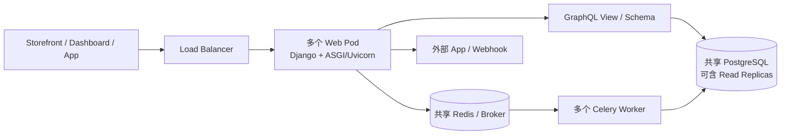

# 00 - Saleor 3.23.25 当前架构图

## 已核验事实

证据：

- `README.md` 把当前产品描述为 GraphQL native、API-only、headless。
- `pyproject.toml` 要求 Python 3.12，并声明 Django、Uvicorn、Celery、Redis、psycopg 3 与 OpenTelemetry 依赖。
- `AGENTS.md` 明确假设多个 Kubernetes Web/Celery Pod、共享 PostgreSQL/read replicas 与 Redis/broker。
- `saleor/graphql/views.py:GraphQLView.dispatch` 接收 HTTP 请求；`saleor/graphql/api.py:schema` 组装 GraphQL schema。

## Owner 边界

| Concern | 当前 owner | 不能据此声称什么 |
| --- | --- | --- |
| HTTP/ASGI | Uvicorn + Django | 不能声称全部 ORM 调用非阻塞 |
| API contract | GraphQL schema/view/resolver | 不能声称 GraphQL 自动消除 N+1 |
| 交易真相 | PostgreSQL | 不能把 Redis 当交易真相 |
| 后台任务 | Celery + broker | 不能声称消息只投递一次 |
| 扩展 | App/Webhook/API | 不能声称网络扩展比进程内插件更简单 |

## Saleor 位于演化链哪一层

它处在“API-only + 多进程/多 Pod + 共享数据库与 broker”这一层，因此当前贡献规则要求 stateless、并发安全、任务幂等，并在事务提交后调度任务。

“历史上是哪次事故直接导致这些规则”没有从当前源码得到证明，必须继续查 issue、PR 或 ADR。

## 费曼复述

为什么当前 Saleor 可以运行多个相同 Web Pod，却不能用某个 Pod 的 Python 全局变量保存 checkout 的真实状态？
