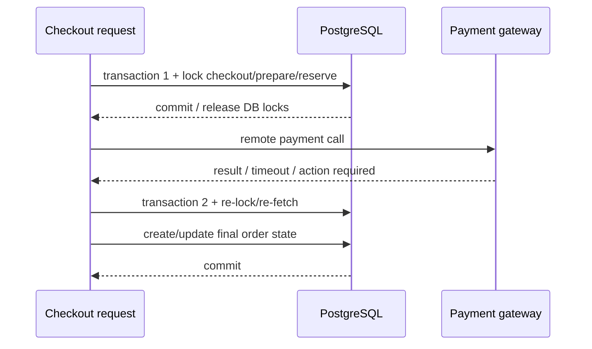
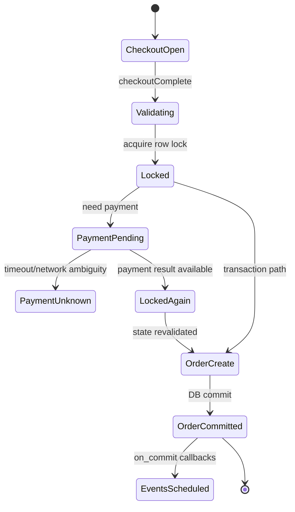

# 09 · Saleor 3.23.25：把前八章重新走成一条真实生产调用链

这一章不再添加新的基础名词。目标只有一个：

> 从用户调用 `checkoutComplete` 开始，沿 Saleor `3.23.25` 的真实代码走到订单创建、支付、库存和 commit 后事件，看看前面学的机制为什么会同时出现。

固定版本：

```text
repository: saleor/saleor
tag: 3.23.25
```

不要用当前 `main` 代替本章源码。

## 1. 先看整条 Runtime Spine

```mermaid
flowchart LR
    A[HTTP / GraphQL] --> B[saleor/graphql/api.py]
    B --> C[CheckoutComplete.perform_mutation]
    C --> D[fetch checkout + lines + info]
    D --> E[complete_checkout]
    E --> F{transaction flow\nor payment flow?}
    F -->|transaction| G[create_order_from_checkout]
    F -->|payment| H[lock checkout + prepare]
    H --> I[process payment outside first transaction]
    I --> J[re-lock + refetch current checkout]
    J --> K[complete_checkout_post_payment_part]
    G --> L[create order + allocate stock]
    K --> L
    L --> M[transaction.on_commit]
    M --> N[order_created / confirmation / async effects]
```



这就是本课程前面所有机制的交汇点。

## 2. Hop 1：GraphQL 入口不是业务逻辑终点

` saleor/graphql/api.py ` 把 Checkout、Order、Payment、Webhook 等域组合进统一 schema。

对本章最重要的理解：

```text
GraphQL endpoint
→ 解析/校验 operation
→ 找到 checkoutComplete field
→ 调用 CheckoutComplete mutation
```

所以 `api.py` 是入口/组装层，不应该把全部 checkout 业务塞在这里。

## 3. Hop 2：`CheckoutComplete.perform_mutation`

在 `saleor/graphql/checkout/mutations/checkout_complete.py`，mutation 先获取 checkout，再验证 email、line、address 等条件，最后把真正完成逻辑交给：

```python
order, action_required, action_data = complete_checkout(
    checkout_info=checkout_info,
    lines=lines,
    manager=manager,
    payment_data=payment_data or {},
    store_source=store_source,
    user=customer,
    app=get_app_promise(info.context).get(),
    site_settings=site.settings,
    redirect_url=redirect_url,
    metadata_list=metadata,
)
```

为什么这里先做输入验证？因为越靠后，副作用越重：锁、支付、订单、事件。能在进入关键区前拒绝的错误，不要拖到支付之后才发现。

### 一个很值得学的重复请求处理

mutation 获取 checkout 失败时，会尝试按 checkout token 找已经创建的 Order；如果找到，就把既有订单当成功结果返回。

这意味着：

```text
第一次 checkoutComplete 已成功创建 Order
但客户端没收到 response
↓
客户端重试
↓
Checkout 可能已经被删除
↓
系统找到对应 Order
↓
返回同一个成功结果，而不是再创建一单
```

这是“业务身份 + 已完成结果查询”式幂等思路的真实例子。

## 4. Hop 3：`complete_checkout` 先决定支付路径

`saleor/checkout/complete_checkout.py` 中，`complete_checkout()` 根据 checkout 的授权状态、transaction、是否允许 unpaid order、零金额等条件，决定：

```text
complete_checkout_with_transaction(...)
或
complete_checkout_with_payment(...)
```

这说明“Checkout 完成”不是单一路径。真实业务状态决定控制流。

## 5. Hop 4：支付路径为什么多次 lock + refetch

支付路径里有一个非常重要的模式：

```python
with transaction_with_commit_on_errors():
    checkout = Checkout.objects.select_for_update().filter(pk=checkout_pk).first()
    ...
    lines, _ = fetch_checkout_lines(checkout)
    checkout_info = fetch_checkout_info(checkout, lines, manager)
```

执行前：

```text
两个请求可能同时尝试完成同一个 checkout
```

`select_for_update()` 后：

```text
当前 transaction 持有 checkout row lock
竞争者等待
```

而且锁内重新 fetch lines/info，不复用很早以前读到的对象。原因是等待锁期间数据可能变化。

这个模式对应第 06 章的核心规则：

> **获取并发控制后，要基于当前状态重新验证，不要拿旧快照继续做关键决策。**

## 6. 为什么支付不一直放在第一个 DB transaction 里

Saleor 源码在完成前置准备后退出第一段 transaction，再处理 payment；代码注释直接说明目的之一是不要长期占着 stock rows，让其他用户也有机会处理相同商品。

把它画出来：



为什么不这样：

```text
BEGIN
锁住一堆行
调用远程支付 8 秒
等待网络
COMMIT
```

因为远程网络等待不是数据库应该长期持锁覆盖的范围，而且 DB transaction 无法“回滚互联网”。

## 7. Payment 后为什么再次 re-lock

支付过程可能花时间，期间 checkout/payment 状态可能变化。

所以后面再次：

```python
checkout = (
    Checkout.objects.select_for_update()
    .filter(pk=checkout_info.checkout.pk)
    .first()
)

lines, _ = fetch_checkout_lines(checkout, skip_recalculation=True)
checkout_info = fetch_checkout_info(...)
```

这不是重复代码造成的“啰嗦”，而是在不同失败边界之后重新建立一个可信的本地 transaction snapshot。

## 8. Order 创建里前八章的机制全部出现

创建 order 时，代码会：

```text
计算 total / shipping / tax
创建 Order
创建 OrderLine
allocate stocks / preorders
迁移 payments / transactions
更新搜索向量
注册 post-create actions
```

关键不是函数很多，而是你现在能按状态分组：

```text
Checkout-derived data
→ Order authoritative state
→ allocation state
→ payment association
→ commit-after side effects
```

## 9. `transaction.on_commit`：为什么事件要等 commit 后

Saleor 在 `_post_create_order_actions()` 里使用：

```python
transaction.on_commit(
    lambda: order_created(...)
)

transaction.on_commit(
    lambda: send_order_confirmation(...)
)
```

如果在 DB commit **之前**就告诉外界“Order created”，但随后 transaction rollback：

```text
外部已经收到订单事件
数据库却没有这个订单
```

`on_commit` 把副作用触发点推到“本地权威状态已经提交”之后。

注意：这和完整 Transactional Outbox 不是一回事。`on_commit` 缩小了“rollback 后误发事件”的风险，但如果进程在 commit 后、实际外部发送前崩溃，仍要结合具体 event/task 实现判断是否存在持久重放能力。

## 10. 一张状态图重新理解 Checkout → Order



真实源码当然比这张图复杂，但这张图保留了最关键的**状态/失败边界**。

## 11. 把前八章逐一映射回来

| 课程机制 | Saleor 3.23.25 中看到的证据 |
|---|---|
| Web / GraphQL | `saleor/graphql/api.py` 统一 schema + Checkout mutation |
| Database transaction | `transaction.atomic()` / transaction helper |
| Row lock | `Checkout.objects.select_for_update()`、`checkout/lock_objects.py` |
| Re-check current state | lock 后重新 fetch checkout lines/info |
| Payment unknown/remote boundary | gateway payment 单独处理，不让第一段 DB transaction 覆盖整个网络调用 |
| Idempotency-style retry | Checkout 已转 Order 时按 token 返回已有 Order |
| Inventory | order 创建路径中的 stock/preorder allocation |
| Async/event boundary | `transaction.on_commit(order_created / send_order_confirmation)` |
| Observability | traced transaction、logging、metrics/Sentry/OpenTelemetry 依赖 |

## 12. 代码阅读顺序

不要按目录名乱逛。按这一条读：

```text
saleor/graphql/api.py
→ saleor/graphql/checkout/mutations/checkout_complete.py
→ saleor/checkout/complete_checkout.py::complete_checkout
→ complete_checkout_with_payment / complete_checkout_with_transaction
→ create_order_from_checkout
→ _create_order_from_checkout
→ _post_create_order_actions
→ saleor/checkout/lock_objects.py
```

每跳只回答四个问题：

```text
输入是什么？
它改变了什么状态？
新的失败边界是什么？
结果交给谁？
```

## 13. 练习

1. 从 `CheckoutComplete.perform_mutation` 开始，写出至少 4 个真实 hop，不允许写文件夹名，只写函数/类和输入输出。
2. 为什么 checkout 已经不存在时，查询已有 Order 并返回，比直接报 404 更适合 retry 场景？
3. 画出 payment flow 的两个 DB transaction 边界，并标出远程支付调用在哪个边界外。
4. 找出至少两处 `select_for_update`，解释每一处保护的状态是否相同。
5. 为什么拿到行锁后还要重新 `fetch_checkout_lines()`？
6. `transaction.on_commit()` 解决了哪一种错误事件？它为什么仍不自动等于 Transactional Outbox？
7. 故障注入题：假设 payment 成功后进程在第二段 transaction 前退出，你需要哪些持久证据才能恢复最终订单状态？
8. 重构题：如果你把所有 `select_for_update()` 删除，最可能先破坏哪几个业务不变量？

### 费曼复述

> 不看源码，完整解释一次 `checkoutComplete` 为什么会经历“验证 → 锁 → 支付边界 → 再锁/重读 → Order → commit 后事件”，以及每个阶段在防什么具体错误。
