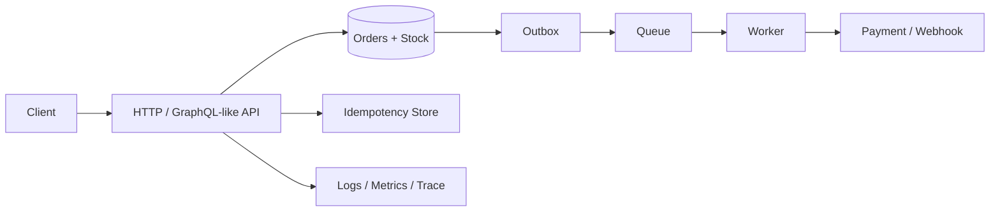

# 10 · 综合练习：你来把 TinyCommerce 从“能跑”推到“能解释失败”

这里没有面试题，也不再新增知识点。目标是把前九章变成你自己的系统模型。

## 1. 综合目标

最终系统至少有：



你不需要实现真正 PostgreSQL、Redis、RabbitMQ 才能开始。先用内存结构把**状态与失败窗口**写对，再替换基础设施。

## 2. 运行 Capstone baseline

```bash
python 10-Practice/01-tinycommerce_capstone.py
```

它目前保护三个不变量：

```text
同一个 idempotency key 只创建一张 Order
一件库存最多成功扣一次
Order 创建时同时留下待发布事件
```

核心代码：

```python
if idem_key in self.idempotency:
    return self.orders[self.idempotency[idem_key]]

self.stock["sku-1"] -= 1
self.orders[order_id] = order
self.idempotency[idem_key] = order_id
self.outbox.append(("ORDER_CREATED", order_id))
```

现在它只是单进程内存模型。真正练习是主动把它弄坏。

## 3. 练习 A：制造超卖

把 checkout 拆成：

```text
read stock
↓
barrier
↓
write stock
```

让两个线程同时操作库存 1。

验收：

```text
先复现两单成功
再用一个明确的 critical section 修复
最后解释单机 Lock 为什么不能保护多 Pod
```

不要只给最终正确代码；保留失败版本和运行输出。

## 4. 练习 B：制造重复支付

实现一个 `FakePaymentProvider`：

```text
第一次调用：扣款成功，但抛 TimeoutError
第二次调用：如果没有 idem key，再扣一次
```

验收：

- unsafe 版本出现两次 charge；
- safe 版本同 key 只产生一次 charge；
- 能解释“客户端 timeout != provider failed”。

## 5. 练习 C：把 Outbox 真正变成崩溃可恢复

当前内存 outbox 一重启就没了。

改成 SQLite：

```text
BEGIN
INSERT order
INSERT outbox
COMMIT
```

然后写 relay：

```text
读取 unpublished outbox
→ publish
→ 标记 published
```

故障注入：publish 成功后、标记 published 前崩溃。

你应该观察到 duplicate，然后给 consumer 加 event_id 幂等。

## 6. 练习 D：Cache Aside + stale window

为商品详情加 cache：

```text
GET product
→ cache hit 返回
→ miss 查 DB 并 set
```

然后更新 DB 但故意不失效 cache，记录 stale 持续多久。

再比较：

- delete on write；
- TTL=1；
- TTL=60；
- random TTL jitter。

不要只写“哪种最好”，写每种牺牲了什么。

## 7. 练习 E：做一次真实 trace

给整个 checkout 生成：

```text
request_id
checkout_id
order_id
payment_attempt_id
event_id
```

每一步输出结构化日志，并记录 span duration：

```text
api.validate
stock.lock
order.create
payment.authorize
outbox.insert
```

验收：给出一个故意 500ms 的慢步骤，你能只看 trace 找到它。

## 8. 练习 F：部署故障

模拟三个实例：

```text
Pod A ready
Pod B ready
Pod C draining
```

要求：

- 新请求不再进 C；
- C 已有 inflight 能完成；
- timeout 后 C 强制退出；
- retry 使用同一个 idempotency key。

这一步把部署和业务幂等连接起来。

## 9. 最终系统设计练习

给出约束：

```text
峰值 3000 checkout/s
库存不可超卖
支付 provider p99=2s，偶发 timeout
Webhook 至少一次
商品详情允许 10s stale
订单创建后 5 分钟内必须最终可追踪
```

你的设计必须回答：

1. 权威状态分别放哪里；
2. 哪些地方需要 transaction；
3. 哪些地方需要 row lock / CAS；
4. 哪些调用允许 retry；
5. idempotency key 的业务身份是什么；
6. 哪些事件走 outbox；
7. cache 失效策略；
8. 哪些 metric/trace 是上线门槛；
9. rolling deploy 时怎样不丢请求；
10. 哪些高级机制你**不会**引入，以及为什么。

## 10. Saleor 对照练习

最后重新打开第 09 章，对照自己的 TinyCommerce：

```text
你的 API entry         ↔ Saleor GraphQL mutation
你的 stock critical   ↔ select_for_update / allocation
你的 idem result      ↔ existing Order by checkout token
你的 payment boundary ↔ payment outside first DB transaction
你的 outbox/event idea↔ on_commit + Saleor event/task mechanisms
```

不是追求“写得像 Saleor”，而是检查你能否理解：**为什么生产代码比最小 Demo 多这些状态和边界。**

## 11. 通过标准

你真正学会这一套，不是因为 README 看完了，而是因为你能：

- 从一个用户动作画出 runtime spine；
- 用具体值手推一次 race；
- 主动制造 timeout/duplicate/stale；
- 写出业务不变量；
- 解释每个机制保护哪个不变量；
- 说出一个机制没解决什么；
- 沿 Saleor 真实源码找到对应实现。

### 最终费曼复述

> 从用户点击“结算”开始，不使用“高并发、分布式、微服务”这类空词，用具体状态解释一个生产后端为什么会逐步需要数据库索引、缓存、MQ、幂等、行锁、状态机、可观测性和优雅部署。
