# Backend Engineer from Scratch

这是一套用 **一个不断长大的 TinyCommerce 商城后端** 串起来的工程课程。

它不按“数据库八股 / Redis 八股 / MQ 八股”孤立背知识，而是让系统先真的出问题，再引出下一层机制：

```mermaid
flowchart LR
    A[一次 HTTP 请求] --> B[数据库保存商品/Checkout]
    B --> C{查询慢?}
    C -->|是| D[Page / Index / B+Tree]
    D --> E{热点读太多?}
    E -->|是| F[Cache / Redis]
    F --> G{耗时工作阻塞请求?}
    G -->|是| H[Queue / Celery]
    H --> I{网络失败与重复执行?}
    I -->|是| J[Retry / Idempotency / Backpressure]
    J --> K{库存与支付跨步骤?}
    K -->|是| L[Transaction / Lock / Saga / Outbox]
    L --> M{出错后看不见?}
    M -->|是| N[Test / Log / Metric / Trace]
    N --> O{单机扛不住?}
    O -->|是| P[Stateless / Readiness / Graceful Shutdown]
    P --> Q[Saleor 3.23.25 完整案例]
```



## 你最终应该能做到什么

学完后，你应该能从一个业务动作开始解释：

> 用户点击“结算”后，请求如何进入服务、如何读写数据库、为什么需要索引、两个人抢最后一件库存时如何避免超卖、支付结果未知时为什么不能直接重试扣款、后台任务如何保证至少一次与幂等、故障时如何通过 trace 找到哪一步慢，最后这些机制在真实 Saleor 中分别落在哪里。

重点不是记名词，而是形成一套可迁移的判断方式：

```text
先找状态 → 再找并发者 → 再找失败边界 → 再决定机制
```

## 学习顺序

| 章 | 现实问题 | 新机制 | 可观察结果 |
|---|---|---|---|
| [00 Computer](00-Computer/README.md) | 同时有很多任务，谁在真正并行？ | process / thread / coroutine | 看见 PID、线程与 await 的差异 |
| [01 Web](01-Web/README.md) | 浏览器发来的字节怎样到业务函数？ | TCP / HTTP / ASGI / GraphQL | 手拆一条请求并追踪入口 |
| [02 Database](02-Database/README.md) | 数据变大后为什么一次查询越来越慢？ | page / buffer / B+Tree / planner / transaction | 看到 I/O 次数与执行计划改变 |
| [03 Redis](03-Redis/README.md) | 热点查询为什么一直打数据库？ | cache-aside / TTL / stampede / Redis | 看见 hit/miss/stale 与击穿 |
| [04 MQ](04-Message-Queue/README.md) | 发邮件/Webhook 为什么不该堵住请求？ | queue / ACK / retry / DLQ / outbox | 看见“至少一次”天然带重复 |
| [05 Distributed](05-Distributed-Systems/README.md) | 网络超时后到底该不该重试？ | idempotency / timeout / retry / backpressure | 看见重复请求不再重复副作用 |
| [06 Transaction](06-Transaction-Systems/README.md) | 库存、订单、支付无法一次原子完成 | row lock / state machine / saga / outbox | 手推超卖、未知支付与补偿 |
| [07 Testing & Observability](07-Testing-Observability/README.md) | 线上失败为什么“本地都正常”？ | test pyramid / log / metric / trace | 用 request_id 串起跨步骤证据 |
| [08 Deployment](08-Deployment/README.md) | 多实例发布时为什么会丢请求？ | stateless / readiness / graceful shutdown | 模拟流量摘除与优雅退出 |
| [09 Saleor Case Study](09-Saleor-Case-Study/README.md) | 真实生产后端怎样把机制组合起来？ | GraphQL → Checkout → Lock → Order → Async | 沿 3.23.25 真实源码走 2–4 跳以上 |
| [10 Practice](10-Practice/README.md) | 能否独立把机制拼回完整系统？ | 综合练习与故障注入 | 产出自己的 TinyCommerce 证据 |

## 每章怎么学

推荐固定四步：

1. **先看图**：只回答“数据/状态从哪里到哪里”；
2. **运行 Demo**：先观察现象，不急着背结论；
3. **回到 README 核心代码带读**：追踪输入、状态变化、输出；
4. **做练习**：先手算，再改代码，最后费曼复述。

## Saleor 基线

生产映射固定到：

```text
saleor/saleor tag: 3.23.25
```

课程不会要求你先通读 Saleor。Saleor 只在你已经理解机制之后出现，作为“这个简单原理在真实业务里为什么会变复杂”的证据。

## 验证

新增的纯 Python 实验不依赖第三方包：

```bash
python 03-Redis/01-cache_aside.py
python 04-Message-Queue/01-at_least_once.py
python 05-Distributed-Systems/01-retry_idempotency.py
python 06-Transaction-Systems/01-overselling_and_lock.py
python 07-Testing-Observability/01-trace_pipeline.py
python 08-Deployment/01-readiness_graceful_shutdown.py
python 10-Practice/01-tinycommerce_capstone.py
```

批量验证：

```bash
python scripts/run_v31_checks.py
```

## 课程规则

- README 是教材，不是导航页。
- 公式、状态机和并发关系先用具体值再抽象。
- 难点必须有图；图服务于推理，不做装饰。
- 不写面试题。所有知识检查改为练习题、故障实验和费曼复述。
- 不虚构 benchmark；没有实际运行就明确写“待验证”。
